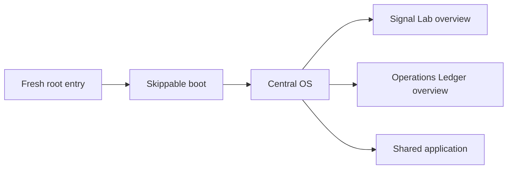
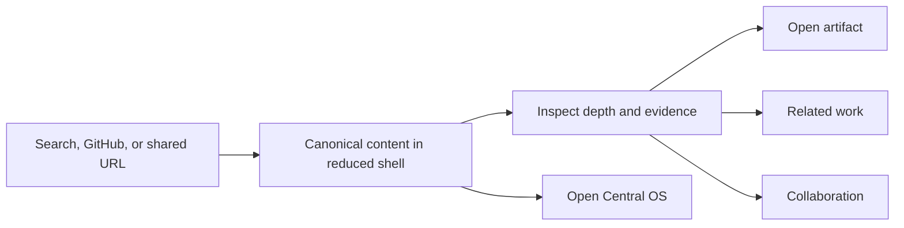
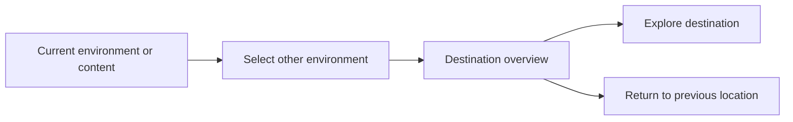
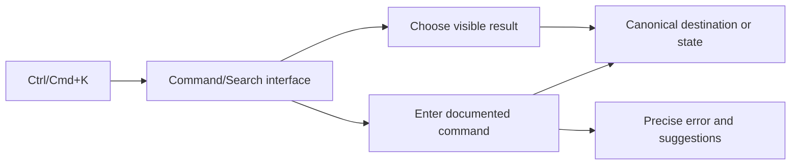

# 10 — Low-Fidelity Wireframes and Critical Flows

**Version:** 1.0  
**Status:** Accepted structural baseline  
**Gate:** 2.3 — Experience Architecture  
**Fidelity:** Structural; not visual styling

## 1. Central OS — root entry

```text
┌ SYSTEM RAIL ─ location / signal / search / map / collaborate ┐
│ OPERATOR: RAIHAN                                             │
│ AI RESEARCH + ENGINEERING / EVIDENCE-LED WORK                │
├────────────────────────┬─────────────────────────────────────┤
│ AI RESEARCH            │ ENGINEERING                         │
│ Signal Lab             │ Operations Ledger                   │
│ [Enter environment]    │ [Enter environment]                 │
├────────────────────────┴─────────────────────────────────────┤
│ RECENT OPERATIONS / revisions across both environments       │
├──────────────────────────────────────────────────────────────┤
│ Ctrl/Cmd+K Command/Search                Collaboration ready  │
└──────────────────────────────────────────────────────────────┘
```

The two gateways have equal area and hierarchy. Recent Operations is secondary
and cannot visually turn one environment into the default identity.

## 2. Environment overview

```text
┌ SYSTEM RAIL / CENTRAL OS / OTHER ENVIRONMENT / SEARCH ───────┐
│ ENVIRONMENT IDENTITY              STATUS / ARCHIVE SUMMARY    │
├───────────────────────────────────┬───────────────────────────┤
│ FEATURED COMPLETED WORK           │ DIRECTORY                 │
│ or honest unassigned state        │ research/cases            │
│                                   │ projects/experiments       │
├───────────────────────────────────┤ journal / coming soon      │
│ RECENT + REVISED WORK             │ collaboration              │
└───────────────────────────────────┴───────────────────────────┘
```

Signal Lab substitutes research instruments; Operations Ledger substitutes
engineering instruments. Shared controls retain position and meaning.

## 3. Research or case study — Brief

```text
┌ REDUCED/PERSISTENT SYSTEM RAIL ───────────────────────────────┐
│ TYPE / STATUS / VERSION / DOMAIN / LICENSE                   │
│ TITLE                                                        │
│ one-sentence significance                                    │
├───────────────────────────────────┬───────────────────────────┤
│ ACCESSIBLE SUMMARY                │ EVIDENCE STATUS           │
│ primary figure or guided entry    │ limitations / artifacts  │
├───────────────────────────────────┴───────────────────────────┤
│ DEPTH: [BRIEF] [METHOD] [EVIDENCE] [ARTIFACT]                │
└──────────────────────────────────────────────────────────────┘
```

## 4. Evidence Depth Rail recomposition

```text
BRIEF       METHOD             EVIDENCE            ARTIFACT
context     objective/target   results             report
summary  →  assumptions     →  uncertainty      →  repository
meaning     procedure          validation           data/version
limits      model/basis        limitations          license
```

The same canonical document changes emphasis. Focus moves to the new depth
heading and the previous state remains reversible. No depth becomes an
independent article.

## 5. Unified Command/Search

```text
┌ COMMAND / SEARCH ─────────────────────────────────────────────┐
│ > [input_________________________________________________]   │
├──────────────────────────────────────────────────────────────┤
│ EXACT DESTINATIONS                                           │
│ PUBLISHED RESULTS                                            │
│ COMING SOON RESULTS [explicit status]                        │
│ COMMANDS / FILTERS                                           │
├──────────────────────────────────────────────────────────────┤
│ Help: go · open · find · filter · depth · signal · read      │
└──────────────────────────────────────────────────────────────┘
```

This is one interface with two input modes, not separate terminal and search
overlays. Visible results make it usable without command knowledge.

## 6. System Map

```text
┌ OPERATIONAL NETWORK ───────────────┬ DIRECTORY ───────────────┐
│          [JOURNAL]                 │ Central OS               │
│             │                      │ AI Research              │
│ [AI]────[CENTRAL OS]────[ENG]      │ Engineering              │
│   │          │           │         │ Shared applications      │
│ research  [SHARED]    cases        │ Declared relationships   │
│                                   │ [Open selected node]      │
└───────────────────────────────────┴──────────────────────────┘
```

Every line has a named relationship. Directory remains the accessible and
reduced-layout source of truth.

## 7. Direct-link reduced shell

```text
┌ RAIHAN'S OS / CURRENT ENVIRONMENT / OPEN CENTRAL OS ─────────┐
│ CANONICAL CONTENT                                            │
│ status / version / license / summary / evidence              │
│                                                              │
│ related work                         collaborate              │
└──────────────────────────────────────────────────────────────┘
```

No boot or forced modal. The page remains complete without Central OS entry.

## 8. Reading mode

```text
┌ TITLE / LOCATION / EXIT READING ──────────────────────────────┐
│ section progress                                             │
│                                                              │
│              focused reading column                          │
│              figures / citations / notes                     │
│                                                              │
│ references / artifacts / related / collaborate               │
└──────────────────────────────────────────────────────────────┘
```

Reading mode removes nonessential instrumentation, not orientation or evidence.

## 9. Collaboration Center

```text
┌ COLLABORATION CENTER ─────────────────────────────────────────┐
│ [Send project brief] [Email] [Professional profile]          │
├───────────────────────────────────┬───────────────────────────┤
│ name / email / organization      │ handling notice           │
│ domain / project type            │ do not submit protected   │
│ objective / scope                │ information               │
│ timeframe / message              │ alternative if delivery   │
│ confidentiality note             │ fails                     │
│ [Review and send]                │                           │
└───────────────────────────────────┴───────────────────────────┘
```

## 10. Critical flows

### Root discovery



### Direct content evaluation



### Environment switching



### Command/search



## 11. Structural critique

- Central OS avoids the generic hero/features/testimonials stack by making the
  two professional worlds the primary operating choice.
- The interface avoids a decorative window manager; regions have persistent
  responsibilities.
- The combined Command/Search surface prevents terminal from becoming an
  expert-only parallel product.
- System Map spectacle is bounded by a directory source of truth.
- Evidence Depth Rail receives the only dominant recomposition gesture.
- Empty featured slots state that no work is assigned; they never fabricate a
  launch flagship.

## 12. Validation tasks before Gate 2.3 closes

Raihan should be able to complete these tasks using only the wireframe model:

1. identify both professional worlds from Central OS;
2. find a published research item visually;
3. find a Coming Soon item and recognize that it has no result;
4. enter Engineering and inspect a case-study artifact;
5. arrive directly on a publication and locate its limitations;
6. switch environment and return;
7. repeat a visual navigation action through Command/Search;
8. enter and exit reading mode; and
9. start a collaboration inquiry.
