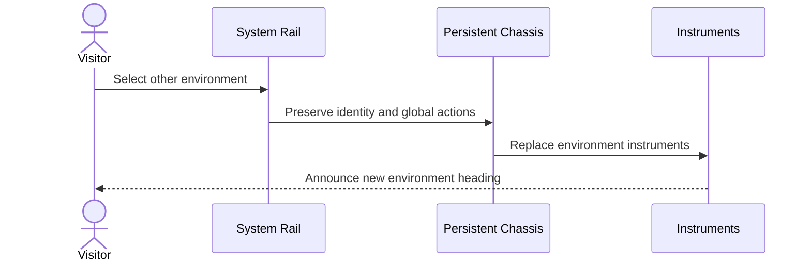
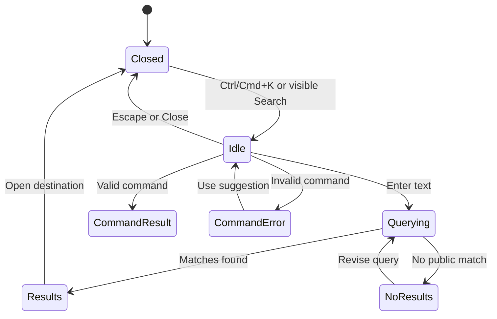
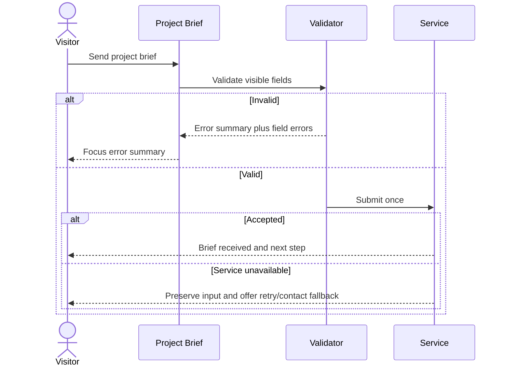

# 30 — Interaction and Motion Storyboards

**Version:** 1.0  
**Status:** Accepted  
**Gate:** 2.5 — High-Fidelity System

## 1. Fresh desktop root boot

```text
T+0000  [VOID]
        System identity available to assistive technology

T+0000–0600  CALIBRATION
             chassis boundaries resolve; no fake diagnostics

T+0600–1600  ROUTES
             Signal Lab and Operations Ledger become available together

T+1600–2600  READY
             focus enters normal document order; boot never traps input
```

Skip control is visible immediately. Boot runs once per browser session only on
an intentional full-console root entry.

Reduced motion:

```text
REQUEST ROOT → READY STATE
```

Direct links, internal navigation, tablet, and mobile always use the reduced
path.

## 2. Environment switch



Standard motion replaces instruments over 320–480 ms without moving the
persistent chassis. Reduced motion performs immediate replacement or a short
fade. Focus moves to the new environment heading only when the action navigates
to a new route.

## 3. Evidence Depth recomposition

```text
VISITOR SELECTS METHOD
        │
        ├─ selected marker moves to METHOD
        ├─ canonical title/metadata remain
        ├─ method receives spatial priority
        ├─ sources and limitations remain reachable
        └─ focus remains on control unless navigation context requires heading
```

Standard motion is one orchestrated 280–420 ms transformation. Reduced motion
replaces the active projection immediately. Browser history behavior is decided
in Gate 2.6 but must not create four independent documents.

## 4. Command/Search lifecycle



Opening focuses the input. Closing restores focus to the invoker. Mobile opens
with visible actions/results before command examples.

## 5. Direct-link entry

```text
SEARCH / GITHUB / SHARED URL
            │
            ▼
CANONICAL CONTENT + REDUCED SHELL
            ├─ read content
            ├─ inspect evidence/sources
            ├─ open artifact state
            ├─ collaborate
            └─ optionally open Central OS
```

No boot, forced modal, or environment tutorial precedes the content.

## 6. Collaboration validation



Loading blocks repeated submission but preserves the action label. No animation
is required to understand success or failure.

## 7. Coming Soon

```text
OPEN COMING SOON ENTRY
        │
        ├─ show registered topic and honest status
        ├─ show what is not yet published
        ├─ do not simulate evidence or completion percentage
        └─ offer [DISCUSS THIS TOPIC] with editable context
```

## 8. Interactive explanation fallback

```text
INTERACTIVE AVAILABLE             INTERACTIVE UNAVAILABLE
controls + live result            static figure/table
        │                          key values
        ├─ same claim              assumptions
        ├─ same values             limitations
        └─ same limitations        textual interpretation
```

Failure never produces an empty canvas or dead loading indicator.

## 9. Focus storyboard

| Event | Focus destination | Restoration |
|---|---|---|
| Open Command/Search | Search input | Invoking control |
| Open critical dialog | Dialog heading or first meaningful field | Invoker |
| Route navigation | New page heading when needed | Not applicable |
| Depth selection | Remains on selected depth control | Not applicable |
| Form validation failure | Error summary | Links move to invalid fields |
| Successful submit | Confirmation heading/status | Not applicable |

## 10. Motion rejection tests

Reject motion that:

- delays access to content beyond the approved boot case;
- runs continuously;
- implies live telemetry without data;
- moves layout on hover or focus;
- breaks focus position or reading context;
- has no reduced-motion equivalent; or
- exists only to imitate a fictional interface.

## 11. Browser evidence required

Phase 3 must capture standard and reduced-motion evidence for boot,
environment switching, Evidence Depth, Command/Search, and Collaboration.
Record duration, focus before/after, viewport, and fallback result.

