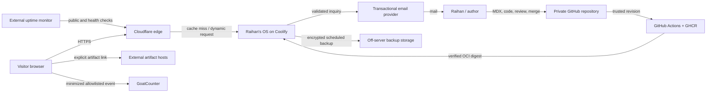
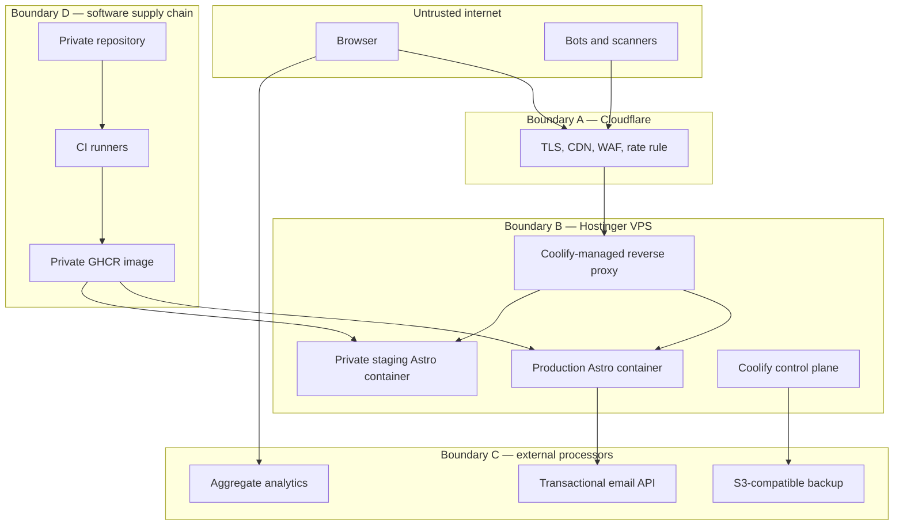
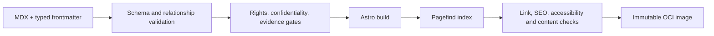

# 34 — Recommended System Architecture

**Version:** 0.9  
**Status:** Proposed — Product Owner decision required  
**Gate:** 2.6 — Architecture and Verification Design

## 1. Architecture thesis

Raihan's OS is a stateless, content-first publication with an application-like
interaction layer—not a stateful web application disguised as a publication.
The architecture therefore pre-renders every normal public route, hydrates only
the controls that need behavior, and reserves server execution for one inquiry
path and operational health.

## 2. Layer-by-layer stack

| Layer | Proposed selection | Boundary |
|---|---|---|
| Language | strict TypeScript; standards-based HTML/CSS | TypeScript 7 after compatibility proof; TypeScript 6 bounded fallback |
| Framework | Astro 7.2 | Default static output; only inquiry and health routes opt out of pre-rendering |
| Interactive UI | React 19.2 islands | Command/search, depth rail, charts, simulations, selected shell controls only |
| Accessible primitives | native HTML first; React Aria Components selectively | No imported visual design language |
| Styling | custom CSS, generated custom properties from `design-tokens.json` | Cascade layers, container queries, logical properties, reduced-motion profiles |
| Content | MDX plus Astro content collections and Zod schemas | Git is canonical; no production CMS or content database |
| Code rendering | Astro/Shiki pipeline | Build-time highlighting; runnable code requires an explicitly reviewed sandbox |
| Charts | Observable Plot for common charts; custom SVG/Canvas when justified | Every chart has title, description, data/table alternative, and keyboard-safe controls |
| Simulations | React island plus Web Worker; precomputed default state | No launch server compute; WASM only after profiling |
| Search | Pagefind 1.5.2 generated after build | Public approved HTML projection only |
| Server boundary | Astro Node adapter on Node 24 LTS | `POST /api/inquiry` and `GET /healthz`; no database |
| Email | Resend transactional API | API key server-only; AWS SES Jakarta is the documented substitute |
| Analytics | GoatCounter hosted, minimized configuration | Closed event allowlist; no sessions, pageview detail, PII, or free-form values |
| Edge | Cloudflare DNS/proxy/CDN/WAF | Static caching; Free Managed Rules; one inquiry rate-limit rule |
| Container | multi-stage OCI image, non-root runtime, read-only where feasible | Same digest in staging and production |
| Registry/CI | private GitHub repository, GitHub Actions, GHCR | SHA-pinned actions; least-privilege workflow permissions |
| Deployment | Coolify 4.1.2 on Hostinger KVM 4 Indonesia | Separate staging and production resources |
| External monitoring | Better Stack uptime and backup heartbeat only | No session replay or application-log shipment at launch |

Exact package pins belong in the Phase 3 lockfile and container manifest. This
document establishes compatibility lines and boundaries, not floating install
commands.

## 3. System context

## 4. Deployment containers and trust boundaries

Staging uses private access control and is excluded from indexing. The Coolify
dashboard, SSH, registry credentials, and backup bucket are operator surfaces;
they are never exposed through application navigation.

## 5. Rendering and routing contract

| Route class | Rendering | JavaScript baseline | Cache posture |
|---|---|---|---|
| Central OS, world gateways, indexes | pre-rendered HTML | optional shell islands | CDN cache with versioned assets |
| Research, experiment, engineering case, project, blog | pre-rendered HTML | only declared chart/simulation/depth islands | CDN cache; direct URL canonical |
| Search | pre-rendered shell plus Pagefind worker/index | required only for search interaction; directory fallback remains | long-lived hashed index assets |
| About/operator record/collaboration page | pre-rendered HTML | form enhancement optional | CDN cache except submission |
| `POST /api/inquiry` | on-demand Node endpoint | not applicable | never cached |
| `/healthz` | on-demand minimal response | none | bypass cache for origin health monitor |
| 404/500 | static safe fallback | none required | bounded caching |

URL state, not hidden global memory, carries shareable state such as selected
environment, search query when safe, and evidence-depth anchor. Theme/profile
selection is session-local and not persisted, matching the approved contract.

## 6. Content and publishing pipeline

- Content types and relationships follow Documents 12–18.
- Every item declares status, environment projection, rights, evidence class,
  dates, canonical slug, summary, and optional interaction manifest.
- `coming-soon` records enter navigation/search only through their approved
  projection and are visibly labelled; they do not impersonate finished work.
- Build failure is the publishing control for invalid schemas, missing required
  relationships, unresolved internal links, unsafe embed origins, or absent
  rights/confidentiality declarations.
- Large artifacts carry checksum, type, size, source host, license/access note,
  and external URL metadata; the site does not proxy them.

## 7. Search lifecycle

1. Astro produces only approved public HTML.
2. Pagefind indexes that build output, selected metadata, filters, and content
   regions; drafts and private material never reach the index input.
3. CI checks deterministic index generation and representative queries.
4. Search files ship inside the same immutable image as the pages.
5. A worker loads the index on demand. If it fails, conventional directory,
   tags, environment indexes, and direct URLs remain usable.

No search query is sent to application logs or analytics. If aggregate search
usage is measured, only `search_open` and coarse result-count buckets are
allowed—never the query text.

## 8. Interaction execution model

Each interactive article block declares:

- input schema, units, ranges, defaults, and validation;
- deterministic seed or declared stochastic behavior;
- computation location and resource budget;
- textual interpretation and static result/table fallback;
- share/reset behavior and error state;
- evidence source, method version, and limitations; and
- keyboard, screen-reader, contrast, and reduced-motion equivalence.

Main-thread work is limited to rendering and short control updates. Moderate
computation runs in a Web Worker with cancellation and time limits. A failure
must collapse to the precomputed reference state without blocking reading.

## 9. Performance and caching budgets

Phase 1 budgets remain normative. The architecture adds these implementation
allocations for representative initial-load pages under laboratory testing:

| Budget | Target |
|---|---:|
| Framework/client JavaScript on a normal reading page | ≤ 75 KiB gzip |
| Initial JavaScript on Central OS | ≤ 150 KiB gzip |
| Any single optional interaction island before explicit activation | ≤ 120 KiB gzip |
| Initial font transfer | ≤ 180 KiB WOFF2 total |
| Initial above-fold imagery | ≤ 350 KiB optimized total |
| Main-thread long task | no task > 50 ms in the reference desktop profile |
| Lighthouse CI performance | ≥ 90 on defined reference pages/profile |

These are engineering allocations, not permission to spend every byte. Charts
and simulations load on visibility or explicit intent. Hashed immutable assets
receive long cache lifetimes; HTML uses revalidation-safe cache headers. The
collaboration endpoint and health endpoint are never cached. Cloudflare HTML
caching is enabled only after authenticated/staging bypass and deploy-purge
behavior are tested.

## 10. Accessibility, SEO, and internationalization consequences

- Semantic document order and canonical navigation exist before islands load.
- The terminal and visual navigation call the same command/action registry;
  neither is a second inaccessible information architecture.
- All animations obey the previously locked reduced-motion behavior, even
  though the Product Owner did not want a separate low-feature design.
- English owns the canonical unprefixed or `/en/` URL decision at scaffold;
  route generation must permit future locale-prefixed equivalents without
  changing content IDs.
- Sitemap, robots, canonical, Open Graph, JSON-LD, feed, and per-item metadata
  are generated from the content model, not maintained manually.
- Direct-linked reading pages never require boot sequence completion.

## 11. Local development and author maintenance

A single documented command should run the local authoring environment; a
single verification command should reproduce CI. Content templates create
valid frontmatter and interaction manifests. Pre-commit checks remain fast;
the full browser matrix runs in CI. Dependabot creates bounded update PRs, but
updates are merged only after the same verification path as product changes.

Monthly maintenance fits the accepted 16-hour weekend capacity by avoiding a
database, CMS, queue, search service, self-hosted analytics database, and
server-compute environment.

## 12. Failure and graceful-degradation matrix

| Failure | Visitor effect | Required response |
|---|---|---|
| JavaScript unavailable | static shell, directories, and full articles remain | terminal/search/simulations expose clear unavailable state or conventional alternative |
| Pagefind unavailable | search unavailable | directory, tags, gateways, direct links remain |
| Chart/simulation error | interactive enhancement unavailable | static figure/table and explanation remain |
| Analytics unavailable | no visitor-facing impact | silently drop event; never block navigation |
| Email provider unavailable | form returns recoverable error | preserve user text only in browser; offer direct email/professional channel; do not log body |
| Cloudflare unavailable/misconfigured | public route may fail | DNS/edge runbook and reversible proxy settings; origin is not casually exposed |
| VPS/container failure | cached assets may remain; origin pages fail after cache | external alert, Coolify rollback/redeploy, documented rebuild |
| GitHub Actions unavailable | publication pauses | existing production remains; no direct unverified production build |
| External artifact host unavailable | linked artifact fails | page and metadata remain; show host/source and optional checksum |

## 13. Portability and exit strategy

- The repository contains content, schemas, application code, container file,
  deployment manifest examples, and provider-neutral environment contracts.
- The OCI image runs on any standard container host. Coolify-specific webhooks
  are confined to deployment workflow configuration.
- Resend implements a small `InquiryDelivery` adapter; AWS SES can replace it
  without changing the route contract.
- GoatCounter calls pass through a typed analytics adapter with a disabled
  implementation. Removal must not affect navigation or rendering.
- Pagefind consumes built HTML; another static indexer can replace it without
  changing canonical content.
- Backups use S3-compatible object storage and documented restore steps.

## 14. Explicit exclusions at launch

No database, Redis, queue, Kubernetes, CMS, GraphQL, authentication system,
server-side model inference, general serverless platform, session replay,
visitor profile, feature-flag SaaS, or microservice is approved. This is not a
permanent ban: each requires an approved requirement and the seven-part
anti-overengineering record before adoption.
