# 36 — CI/CD, Operations, Backup, and Recovery

**Version:** 0.9  
**Status:** Proposed — Product Owner decision required  
**Gate:** 2.6 — Architecture and Verification Design

## 1. Service objectives

| Objective | Launch target | Measurement |
|---|---:|---|
| Public monthly availability | ≥ 99.5% | independent production HTTP monitor; planned maintenance recorded separately but still visible |
| Recovery point objective | ≤ 24 hours | last successful off-server configuration backup and source/image availability |
| Recovery time objective | ≤ 8 hours | timed restore/rebuild drill from declared disaster |
| Content publication | after protected merge and passing pipeline | deployment record contains commit and image digest |
| Restore confidence | pre-launch, then quarterly | dated drill evidence with observed RPO/RTO |

These are internal service objectives, not a contractual SLA.

## 2. Environment topology

| Environment | Source | Access | Purpose | Data/secrets |
|---|---|---|---|---|
| Local | working branch | Raihan's device | authoring, unit/component checks | development-only provider stubs or test credentials |
| Pull request | CI artifact/report; optional ephemeral preview | private reviewer access | deterministic review and automated evidence | no production secrets; no live inquiry delivery |
| Staging | release-candidate image digest | private access, `noindex` | browser, security, provider sandbox, smoke and restoration validation | staging-specific credentials and recipient |
| Production | same verified digest promoted from staging | public through Cloudflare | live product | production-scoped minimal credentials |

Staging and production are distinct Coolify resources. They may share the VPS
initially, but they do not share secrets, hostnames, mail recipients, analytics
site IDs, or deployment hooks.

## 3. Branch and release policy

- The default branch is protected. Direct and force pushes are disabled.
- A pull request requires all launch-applicable checks and explicit review by
  Raihan. That merge is the manual authorization event.
- CI builds once from the merge commit, tags the image with the full commit SHA,
  records the digest, and never treats `latest` as release identity.
- The candidate digest deploys to staging. Automated smoke checks run against
  the deployed hostname. Only that passing digest is promoted to production.
- No second production approval is required, matching the Product Owner's
  decision. A failing, cancelled, or ambiguous staging check stops promotion.
- Production deployment is serialized. A newer release cancels or supersedes
  an older queued release, never a release already applying migrations (there
  are no launch database migrations).

## 4. CI/CD pipeline

```mermaid
flowchart LR
  PR["Pull request"] --> Fast["Format, lint, types, schemas, unit"]
  Fast --> Deep["Content policy, links, build, search, security"]
  Deep --> Browser["E2E, a11y, visual, performance"]
  Browser --> Review["Raihan review and merge"]
  Review --> Build["Build OCI image once"]
  Build --> Scan["SBOM + image scan + digest"]
  Scan --> Stage["Deploy digest to staging"]
  Stage --> Smoke["Origin/edge critical-flow smoke"]
  Smoke --> Prod["Promote same digest to production"]
  Prod --> Verify["Post-deploy checks and monitor annotation"]
```

### Workflow security

- Third-party actions are pinned to full commit SHAs and reviewed on update.
- Default workflow token permissions are read-only; package publish and deploy
  jobs receive only their required scoped permissions.
- Fork/untrusted pull-request jobs cannot access provider, registry-write, or
  production deployment secrets.
- Build metadata records repository, commit, timestamp, Node/package-manager
  versions, lockfile digest, image digest, and dependency/SBOM scan result.
- Container runs as a non-root user with a minimal base, production-only
  dependencies, health check, resource limits, and graceful shutdown.
- GHCR retention preserves at least current production, previous known-good,
  current staging candidate, and releases necessary for the recovery window.

## 5. Rollback policy

Rollback means redeploying a previously verified image digest; it does not mean
rebuilding an old branch with today's dependencies.

Automatic rollback is allowed only when the post-deploy health/critical-route
checks fail clearly and the previous digest is healthy. Otherwise the workflow
stops, preserves evidence, alerts Raihan, and follows the incident runbook.
Because content is inside the image and there is no application database,
rollback has no schema compatibility risk at launch.

Rollback evidence includes failed digest, previous digest, trigger, timestamps,
monitor results, operator/action identity, and outcome. No inquiry content is
recorded.

## 6. Observability and alerting

### Launch signals

| Signal | Source | Alert threshold/action |
|---|---|---|
| Public availability and response keyword | external monitor through Cloudflare | confirm from multiple checks; email alert |
| Origin health | protected/allowlisted health check that bypasses cache | alert if public is cached but origin fails |
| Collaboration synthetic health | safe provider-independent readiness check; no email body | alert on endpoint/provider readiness failure |
| TLS/domain expiry | external monitor and registrar | advance alert |
| Container health/restarts/resources | Coolify/Docker | investigate repeated restart or sustained resource threshold |
| Backup completion | daily job heartbeat | alert on missing heartbeat after grace period |
| Deployment outcome | GitHub Actions/Coolify | alert on failed staging, promotion, or post-deploy check |

### Logging policy

Use structured JSON operational logs with level, timestamp, component, release
digest, correlation ID, outcome class, latency bucket, and safe error code.
Redact authorization headers, cookies, tokens, full query strings, search text,
inquiry fields, request bodies, and provider responses that may echo content.
Rotate locally and retain for 30 days. Do not ship logs to a third party at
launch; add remote logging only after a diagnosed requirement and privacy/cost
assessment.

## 7. Backup architecture

The recoverable system consists of:

1. private Git repository and protected history;
2. immutable GHCR images and release metadata;
3. Coolify configuration database and resource definitions;
4. encrypted secret inventory/recovery material;
5. DNS/Cloudflare configuration record;
6. VPS/OS hardening and rebuild runbook; and
7. optional aggregate analytics export, which is not required to restore the
   product.

### Backup layers

| Layer | Frequency/retention | Destination | Purpose |
|---|---|---|---|
| Git and GHCR | every accepted change/release; retain known-good releases | GitHub | source and deployable artifact |
| Coolify configuration DB | daily; 7 daily, 4 weekly, 3 monthly | encrypted independent S3-compatible storage | rebuild application definitions and deployment state |
| Hostinger VPS backup | paid daily option; provider's current 2 daily + 2 weekly points | Hostinger control plane | rapid whole-server recovery |
| Secret/recovery inventory | on change plus quarterly verification | encrypted offline or independent secure vault | restore provider access and values not safely reconstructible |
| DNS/infrastructure configuration export | on change and quarterly | private repository with secrets excluded | recreate edge and records |

Hostinger weekly backup alone fails the 24-hour RPO and is rejected. Provider
backup alone also fails independence; off-server configuration backup is
mandatory. Backup success without restoration is not evidence of recovery.

## 8. Recovery runbooks

### Scenario A — bad application release

1. Freeze deployment queue and capture failing digest/check evidence.
2. Redeploy previous known-good digest in Coolify.
3. Verify `/healthz`, Central OS, one AI article, one Engineering article,
   search, collaboration readiness, headers, and edge cache behavior.
4. Record observed recovery time and open a corrective change.

Target: under 30 minutes.

### Scenario B — lost application container/Coolify resource

1. Restore resource configuration or recreate from documented manifest.
2. retrieve the known-good image by digest from GHCR;
3. restore environment secrets from the controlled inventory;
4. deploy and verify origin before enabling edge traffic.

Target: under 2 hours.

### Scenario C — VPS unavailable or destroyed

1. Declare incident, preserve provider evidence, and decide provider restore
   versus clean replacement.
2. Provision supported Linux, harden access/networking, and install the pinned
   Coolify version or the approved newer patched version.
3. Restore Coolify configuration from independent storage or reconstruct from
   the manifests.
4. restore secrets, deploy the known-good image digest, configure health and
   resource limits, and validate origin;
5. repoint/enable Cloudflare only after full smoke and security checks;
6. validate monitors, backup job, and inquiry delivery; record RPO/RTO.

Target: under 8 hours.

### Scenario D — provider/account compromise

Isolate the affected integration, rotate its credentials and dependent
webhooks, review deployment/DNS history, rebuild from a known-good commit and
digest when integrity is uncertain, and restore service through the documented
adapter or provider exit path. DNS/registrar and repository compromise require
an explicit integrity review before normal publication resumes.

## 9. Restore-test schedule and evidence

| When | Required drill |
|---|---|
| Before first production launch | full clean-environment rebuild plus bad-release rollback |
| Quarterly | Coolify configuration restore into an isolated target; secret-inventory and DNS runbook review |
| After material Coolify/OS/backup-provider change | targeted restore and rollback validation |
| Annually | full VPS-loss tabletop plus timed technical rebuild |

Evidence records backup ID/date, encryption status, restoration target,
restored commit/image digest, checks executed, data loss window, elapsed time,
exceptions, and approver. Test targets must not send real inquiries or analytics.

## 10. Capacity and resource policy

The KVM 4 capacity is ample, but noisy-neighbor risk can come from other
Coolify workloads. At launch, reserve explicit CPU/memory limits for staging
and production, keep at least 25% disk free, alert before 80% disk use, rotate
container/image logs, and prune only according to the release-retention policy.
Do not add services merely to consume available RAM.

A load test in Phase 3 establishes a baseline for public cached pages and the
uncached inquiry endpoint. The spike case is defined from measured throughput;
it is not guessed during design.

## 11. Cost model at research date

| Item | Launch posture | Expected incremental cost |
|---|---|---:|
| Existing Hostinger KVM 4 | reuse existing Indonesia VPS | sunk/existing; plan price must be checked in account |
| Cloudflare Free | DNS/CDN/WAF/rate rule | USD 0 |
| GitHub private repository/Actions/GHCR | use included quota, monitor Actions/image storage | USD 0 initially if within quota |
| GoatCounter hosted | reasonable public-site free use, confirm account terms | USD 0 initially |
| Resend Free | far above expected inquiry volume | USD 0 initially |
| Better Stack Free | 3–4 monitors plus backup heartbeat | USD 0 initially |
| Hostinger daily backup | required to complement independent backup | current account price, recheck before purchase |
| Independent S3-compatible storage | small encrypted configuration backup | likely low single-digit USD/month; provider selection pending |

Price is not the primary selection driver. The main cost is the operator time
required to patch, test, recover, and document each service; this is why the
architecture rejects self-hosted analytics and an application database at
launch.

## 12. Pre-launch infrastructure facts still required

- exact VPS operating system and patch level;
- other workloads sharing the VPS and their resource limits;
- actual Coolify version installed, not only the latest available version;
- current Hostinger backup entitlement and last successful restore;
- domain registrar, DNS ownership, and Cloudflare account;
- selected independent S3-compatible provider and bucket region;
- GitHub plan/Actions/GHCR quota and protected-branch capabilities; and
- verified provider accounts, MFA, recovery contacts, and secret ownership.

These are implementation evidence requests, not reasons to delay the Gate 2.6
architecture choice.
